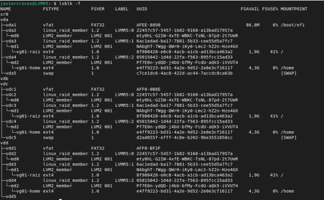

# SCRIPT_ISO_EST
Grupo conformado por Jose Carlos Rodriguez , Jairo Dominguez , Miguel Figueroa , Noelia Medina , Pedro Pozo y Francisco Javier Cruces 
El programa esta conformado por dos ficheros uno principal y uno que contiene las funciones .

Crearemos el siguiente esquema :

Funciones:
1. Comprobar si somos root (JAIRO)
2. Comprobar si tenemos conexion a internet (PEDRO)
3. Comprobar en que sistemas operativo estamos (NOELIA)
4. Actualizar los repositorios (dependiendo si es Debian o Rocky)(NOELIA)
5. Ver si los paquetes lvm2 mdadm dosfstools sgdisk(PEDRO)
6. Instalar los paquetes si estan en el sistema (JAIRO) 
7. Comprobar el numero de dispositivos libres hay y ademas que estos esten vacios (Necesitamos 4 ) (MIGUEL)
8. Si hay 4 , particionaremos 1 disco como en la practica 5 (MIGUEL)
9. Copiaremos la tabla de particiones del disco 1 al disco 2,3,4. (PEPE)
10. Crearemos el raid 5 , 4to disco spare (PEPE)
11. Creamos el volumen fisico (JAVIER)
12. Creamos el grupo de volumenes (JAVIER)
13. Creamos los discos logicos (JAVIER)

### Acceso a instancia:
IP: 172.22.201.199

Usuario: debian

Contraseña: 3cvDKOMfOPmZiNHuRG41qZ3QUTgJ5ADuBSbSzOeeC3vHDbwzKL
